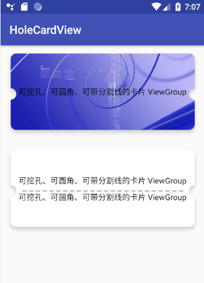

[  ](https://bintray.com/vegen/OpenCode/HoleCardView/_latestVersion)

## 使用

```
implementation 'com.vegen.open:HoleCardView:+'
```
`其中 '+' 请填写版本号 Download 后的最新版本`

## 使用示例
布局
```
<?xml version="1.0" encoding="utf-8"?>
<android.support.constraint.ConstraintLayout xmlns:android="http://schemas.android.com/apk/res/android"
    xmlns:app="http://schemas.android.com/apk/res-auto"
    xmlns:tools="http://schemas.android.com/tools"
    android:layout_width="match_parent"
    android:layout_height="match_parent"
    tools:context=".MainActivity">

    <com.vegen.open.library.HoleCardView
        android:layout_width="match_parent"
        android:layout_height="150dp"
        app:layout_constraintLeft_toLeftOf="parent"
        app:layout_constraintRight_toRightOf="parent"
        app:layout_constraintTop_toTopOf="parent"
        android:layout_marginTop="10dp"
        android:layout_marginLeft="10dp"
        android:layout_marginRight="10dp"
        app:holeElevation="8dp"
        app:holeBackgroundColor="@android:color/white"
        app:holeScallopRadius="10dp"
        app:holeCornerRadius="10dp">
        <RelativeLayout
            android:layout_width="match_parent"
            android:layout_height="match_parent">
            <ImageView
                android:layout_width="match_parent"
                android:layout_height="match_parent"
                android:src="@mipmap/demo"
                android:scaleType="centerCrop"/>
            <TextView
                android:layout_width="wrap_content"
                android:layout_height="wrap_content"
                android:textColor="@android:color/black"
                android:textSize="14dp"
                android:text="可挖孔、可圆角、可带分割线的卡片 ViewGroup"
                android:layout_centerInParent="true"/>
        </RelativeLayout>

    </com.vegen.open.library.HoleCardView>

    <com.vegen.open.library.HoleCardView
        android:layout_width="match_parent"
        android:layout_height="150dp"
        app:layout_constraintLeft_toLeftOf="parent"
        app:layout_constraintRight_toRightOf="parent"
        app:layout_constraintTop_toTopOf="parent"
        android:layout_marginTop="180dp"
        android:layout_marginLeft="10dp"
        android:layout_marginRight="10dp"
        app:holeElevation="8dp"
        app:holeBackgroundColor="@android:color/white"
        app:holeScallopRadius="10dp"
        app:holeCornerRadius="10dp"
        app:holeShowDivider="true">
        <LinearLayout
            android:layout_width="match_parent"
            android:layout_height="match_parent"
            android:orientation="vertical"
            android:gravity="center">
            <TextView
                android:layout_width="wrap_content"
                android:layout_height="wrap_content"
                android:textColor="@android:color/black"
                android:textSize="14dp"
                android:text="可挖孔、可圆角、可带分割线的卡片 ViewGroup"
                />

            <TextView
                android:layout_marginTop="10dp"
                android:layout_width="wrap_content"
                android:layout_height="wrap_content"
                android:textColor="@android:color/black"
                android:textSize="14dp"
                android:text="可挖孔、可圆角、可带分割线的卡片 ViewGroup"
                />
        </LinearLayout>

    </com.vegen.open.library.HoleCardView>

</android.support.constraint.ConstraintLayout>
```

demo 效果如下


## 相关属性

| **属性名称**  | **意义** | **类型** | **默认值** |
| --- | --- | --- | --- |
| holeOrientation | 卡片的圆角方向 | enum | horizontal |
| holeBackgroundColor | 卡片颜色 | color | android.R.color.white |
| holeScallopRadius | 卡片半圆的半径 | dimension | 20dp |
| holeScallopPositionPercent | 卡片半圆显示在所在方向的百分比位置 | float | 50 |
| holeShowBorder | 是否显示边框 | boolean | false |
| holeBorderWidth | 边框宽度 | dimension | 2dp |
| holeBorderColor | 边框颜色 | color | android.R.color.black |
| holeShowDivider | 是否显示分割线 | boolean | false |
| holeDividerWidth | 分割线的宽度 | dimension | 2dp |
| holeDividerPadding | 分割线两端的距离 | dimension | 10dp |
| holeDividerColor | 分割线颜色 | color | android.R.color.darker_gray |
| holeDividerType | 分割线模式，normal：直线，dash：间隔分割线，默认 | enum | dash |
| holeDividerDashGap | 圆帽大小 | dimension | 4dp |
| holeDividerDashLength | 分割线的长度 | dimension | 8dp |
| holeCornerType | 控件的类型，normal：矩形；rounded：圆角矩形，默认；scallop：外向圆角 | enum | rounded |
| holeCornerRadius | 圆角半径 | dimension | 10dp |
| android:elevation | 阴影 | dimension | 0f |
| holeElevation | 阴影 | dimension | 0f |


> 注意：只能有一个直接子布局